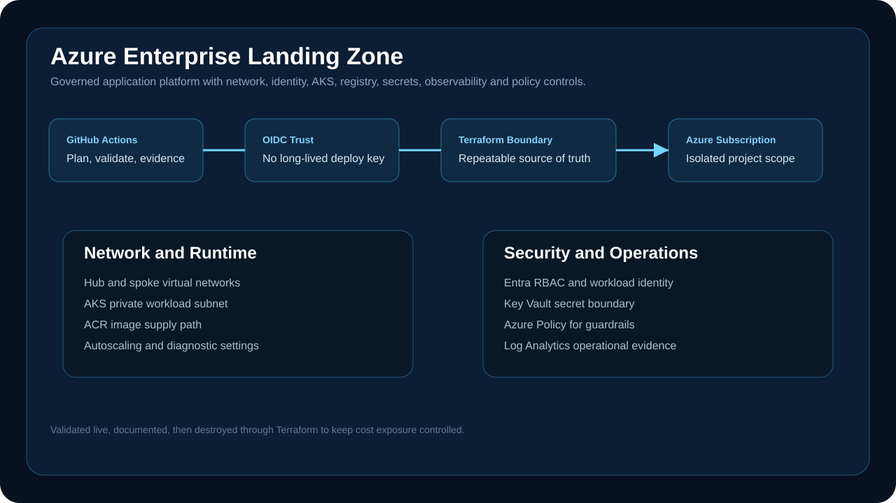
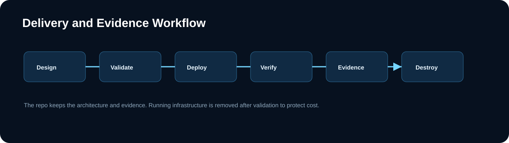

# Azure Enterprise Landing Zone

A production-oriented Azure application landing zone built with Terraform. The project shows how a platform team can provide governed cloud foundations for application teams without relying on manual portal configuration.



## Executive Summary

This repository models a controlled Azure landing zone for regulated application delivery. It brings together network segmentation, AKS, ACR, Key Vault, Entra-integrated access, policy guardrails, observability, CI validation and cost-controlled teardown.

The project was validated live, documented with evidence, and then destroyed through Terraform to keep spend controlled. The repo remains the reproducible source of truth.

## Engineering Scope

| Area | Implementation |
| --- | --- |
| Cloud foundation | Hub-and-spoke network, workload resource group, environment tagging |
| Runtime | Azure Kubernetes Service with Azure CNI overlay and autoscaling |
| Supply path | Azure Container Registry for controlled image publishing |
| Identity | Microsoft Entra integration, OIDC-ready delivery, workload identity pattern |
| Secrets | Azure Key Vault boundary for application and platform secrets |
| Guardrails | Azure Policy thinking for AKS and platform governance |
| Operations | Log Analytics, diagnostics, evidence notes and teardown runbook |
| Cost control | No always-on firewall or gateway tier for portfolio validation; documented expansion path |

## Architecture

The architecture separates delivery identity, network foundation, workload runtime, secret management and operational evidence.



## Repository Map

| Path | Purpose |
| --- | --- |
| `terraform/` | Azure landing-zone infrastructure modules and environment inputs |
| `.github/workflows/` | Terraform validation and plan workflow structure |
| `docs/architecture.md` | Architecture notes and production expansion path |
| `docs/security.md` | Security controls, trust boundaries and hardening decisions |
| `docs/cost-control.md` | Cost-control model and teardown strategy |
| `docs/evidence/` | Validation and destroy evidence |
| `docs/runbooks/` | Operating runbooks |

## Validation Model

```powershell
cd terraform
terraform fmt -check
terraform validate
terraform plan
terraform apply
terraform destroy
```

The workflow is designed around repeatable proof: code review, Terraform validation, live deployment, resource verification, evidence capture and controlled destroy.

## Production Expansion Path

For a production tenant, the next controls would be added deliberately:

- Azure Firewall or managed network egress with cost approval.
- Private DNS integration for private endpoints.
- Application Gateway or ingress controller with WAF controls.
- Remote state in a locked storage account with RBAC and soft delete.
- Azure Policy assignments enforced at management group or subscription scope.
- Defender for Cloud recommendations reviewed as an operating process.

## Interview Defense

This project is not a toy AKS deployment. The important engineering value is the boundary design: identity, delivery, network, runtime, secrets, observability, policy and teardown are treated as one platform lifecycle. The cost choices are intentional and documented, not missing work.

## Status

Live-validated project evidence. Infrastructure was deployed for validation, documented, then destroyed through Terraform to keep cost exposure controlled.

## Safety Boundary

This project is isolated from OpsChugex production. It does not modify or depend on the Lightsail instance hosting the live website and application.